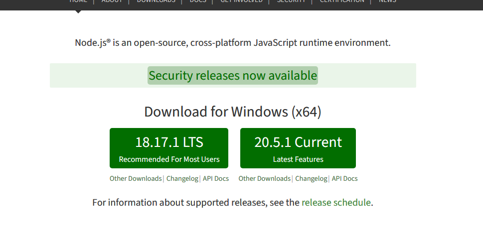

### 安装 **nodejs** 环境

> [nodejs 官网](https://nodejs.org)

前往官网下载 LTS 版本的 **nodejs** (进不去请自备魔法)



然后根据安装向导安装 **nodejs**

安装完成过后，打开命令提示符输入以下命令

```
node -v

npm -v
```

如果没有显示未知命令，则代表安装成功

### 下载并配置 **go-cqhttp**

> [go-cqhttp](https://github.com/Mrs4s/go-cqhttp/releases)

从 releases 中下载符合你设备的 go-cq 并放至在一个你喜欢的文件夹

(这里不写 gocq+sign server 的教程,只写 go-cq)

运行 go-cq 选择正向 Websocket 通信

然后在生成的配置文件(config.yml)中填入机器人 QQ 的

账号密码 再次启动 go-cq，根据指示来登录

登录完成你就可以挂着了

### QQ 官方机器人支持

> [QQ_Bot](QQ_Bot.md)

### 下载 **xianyubb-bot**

> [xianyubb-bot](https://github.com/xianyubb/xianyubb-bot/releases)

从 releases 中下载 **xianyubb-bot.zip** 并解压至一个你喜欢的文件夹

然后执行以下命令

```
cd xianyubb-bot

npm install
```

### 运行 **xianyubb-bot**

在 xianyubb-bot 文件夹中打开命令提示符

输入命令 `node app.js`

运行成功过后会在该目录下生成一个名为 config 的文件夹 (目前已自带配置文件)

里面是配置文件 config.json

```json
{
  "ws": "ws://您的IP:端口",
  "bds": { "use": false, "port": 8081 }
}
```

在里面填入你的 go-cq 的 IP 和 端口 (默认是 127.0.0.1 8080)

然后再次输入命令启动 bot，显示连接成功即可用

如果 go-cq 在本地 IP 不用改

端口要和 gocq 的 ws 的端口一致

在 gocq 的配置文件最下面就可更改端口

启动插件示例:


连接 go-cq 失败会报错，按任意键即可退出程序

###### Tip:

打不开网站的请自备魔法
